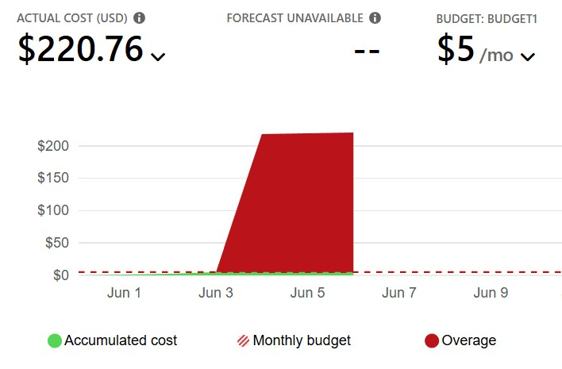

# POSTMORTEM.md

## Azure Cost Overrun (May 2025)

*Figure: Unexpected Azure billing from initial prototype.*

---

## Summary

In May 2025, the initial version of Kardiaflow was deployed to Azure using ADLS Gen2,
Azure Data Factory (ADF), and Databricks. The project processed only synthetic test
files, but nonetheless generated over **$200 in charges** due to architecture oversights.

---

## Root Causes

### 1. ADLS Gen2 Transaction Costs  
- PySpark jobs used `overwrite` mode on partitioned directories, triggering **tens of thousands of write operations**.  
- ADLS Gen2 bills **per transaction**, not per volume.  
- Total data size was small (~10MB), but transaction volume drove **$150+ in storage access fees**.

### 2. Idle NAT Gateway from SHIR  
- Provisioning a Self-Hosted Integration Runtime (SHIR) for ADF created a **NAT Gateway** for outbound traffic.  
- The NAT incurred **hourly charges** regardless of traffic volume.  
- One week of idle time led to **~$10 in costs**.

### 3. No Teardown Automation  
- Resource groups, workspaces, and services remained active after short test runs.  
- Manual cleanup was delayed, leading to continued billing.

### 4. Missing Budget Alerts  
- No cost thresholds or alerts were configured in the Azure subscription.  
- Charges escalated without warning until manually reviewed.

---

## Impact

| Area             | Description                               |
|------------------|-------------------------------------------|
| Azure billing    | Over $200 total charges across services   |
| Cleanup effort   | Manual teardown, Azure support engagement |
| Project timeline | Delayed while redesigning from scratch    |

---

## Resolution

- All resource groups were deleted and the Azure subscription was closed.  
- Code and test datasets were preserved locally.  
- A new subscription was created with zero preprovisioned services.  
- Architecture was redefined around **strict teardown, cost visibility, and minimal surface area**.

---

## Redesign Highlights

| Design Constraint           | Implementation                                                        |
|-----------------------------|------------------------------------------------------------------------|
| Disposable infrastructure   | Bicep provisions all resources inside a single RG, destroyed after use |
| No cost-trap services       | Avoided ADLS, SHIR, NAT, and unnecessary networking components         |
| Budget enforcement          | Soft limit ($2) with email/SMS alerts configured                      |
| Minimal compute footprint   | 1-node cluster with 10-minute autostop, jobs run in <1¢                |
| Storage strategy            | All staging to DBFS, avoiding transactional billing                    |